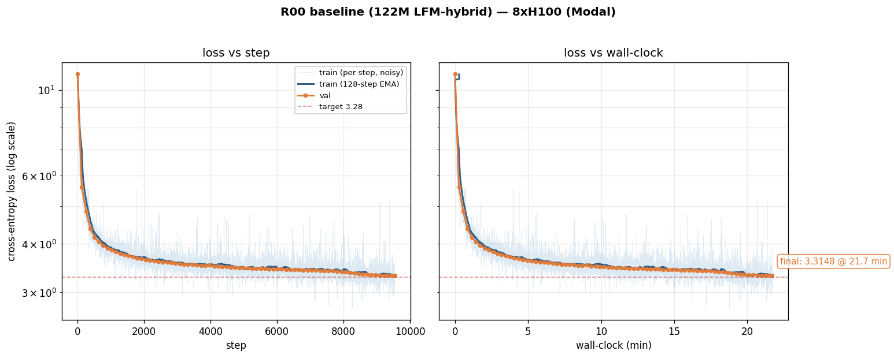

# modded-nanolfm

This repository hosts the *LFM speedrun*: we (collaboratively | competitively)
search for the fastest single-node algorithm to train each official **LFM2
(Liquid Foundation Model)** size from scratch on the
[FineWeb](https://huggingface.co/datasets/HuggingFaceFW/fineweb) validation
set, mirroring the methodology of
[KellerJordan/modded-nanogpt](https://github.com/KellerJordan/modded-nanogpt).

The architecture follows the
[LFM2 Technical Report](https://arxiv.org/abs/2511.23404) and the HF
[`Lfm2`](https://github.com/huggingface/transformers/blob/main/src/transformers/models/lfm2/modular_lfm2.py)
/ [`Lfm2MoE`](https://github.com/huggingface/transformers/blob/main/src/transformers/models/lfm2_moe/modular_lfm2_moe.py)
reference: a hybrid backbone of gated short causal convolutions interleaved
with grouped-query attention (QK-Norm + Gemma-style RoPE), with the MoE
variant adding 32-expert top-4 routing.

We run **5 tracks** — one per official LFM2 release shape:

| Track | Variant | Backbone | Params (this repo) | Status |
|-------|---------|----------|-------------------:|--------|
| [D-350M](records/track_d350m/)   | Dense | 16 L · d=1024 · FF=4608 · 16Q / 8KV | ~339 M | active |
| [D-700M](records/track_d700m/)   | Dense | 16 L · d=1536 · FF=6912 · 24Q / 8KV | ~719 M | open |
| [D-1.2B](records/track_d1_2b/)   | Dense | 16 L · d=2048 · FF=8192 · 32Q / 8KV | ~1.14 B | open |
| [D-2.6B](records/track_d2_6b/)   | Dense | 30 L · d=2048 · FF=10752 · 32Q / 8KV | ~2.54 B | open |
| [MoE-8B-A1B](records/track_moe_8b/) | MoE  | 24 L · d=2048 · 32E / top-4 · FF<sub>moe</sub>=1792 | 8.3 B / 1.5 B active | spec-only |

All dense tracks share the same trainer at HEAD (`train_lfm.py`); the model
shape is chosen by the `TRACK` env var. Per-track records and targets live
under [`records/track_*/`](records/).

---

## Running the current record

```bash
git clone <this-repo> modded-nanolfm && cd modded-nanolfm
uv sync
uv run python data/cached_fineweb10B.py 50    # ~5 B tokens of FineWeb-GPT2
TRACK=d350m ./run.sh                          # → records/track_d350m/R00
```

Add `torchrun` to `PATH` if `./run.sh` errors with `torchrun: command not found`.

> **Note**: `torch.compile` adds ~30 s of latency on the first run.

Official records are timed on **8 × H100** for dense tracks and **8 × B200**
for the MoE track. The local dev path uses an RTX PRO 6000 Blackwell
(96 GB GDDR7) as a single-GPU smoke rig.

### Useful env overrides

```bash
TRACK=d350m            ./run.sh   # canonical Track D-350M
TRACK=d700m            ./run.sh   # canonical Track D-700M
TRACK=d1_2b            ./run.sh   # canonical Track D-1.2B
TRACK=d2_6b            ./run.sh   # canonical Track D-2.6B
TRACK=                 ./run.sh   # pipeline-validation 122M baseline (default)

SMOKE=1 TRACK=d350m    ./run.sh   # 50 iters, no compile -- pipeline check
NPROC=8 TRACK=d1_2b    ./run.sh   # 8-GPU local run (DDP via torchrun)

NUM_ITERATIONS=20000 LEARNING_RATE=2e-3 TRACK=d350m ./run.sh    # ad-hoc tweak
```

See [`train_lfm.py`](train_lfm.py) `_apply_env_overrides` for the full set
(USE_COMPILE, NO_COMPILE, DEVICE_BATCH_SIZE, BATCH_SIZE, SEQUENCE_LENGTH,
WEIGHT_DECAY, GRAD_CLIP, VAL_LOSS_EVERY, VAL_TOKENS).

---

## Running on cloud (Modal: H100 / B200)

For canonical timing we use [Modal](https://modal.com). One-time setup:

```bash
uv sync
uv run modal setup                                              # OAuth
uv run modal run modal_app.py::download_data --num-chunks 50    # ~5 B tokens, persists
```

Then launch the track of your choice on the appropriate GPU profile:

```bash
# Dense -- canonical 8 × H100 timing
TRACK=d350m  scripts/launch_modal.sh h100x8 d350m_R00
TRACK=d1_2b  scripts/launch_modal.sh h100x8 d1_2b_R00

# Dense -- fastest single-node throughput
TRACK=d2_6b  scripts/launch_modal.sh b200x8 d2_6b_R00

# Single-GPU dev iteration
TRACK=d350m  scripts/launch_modal.sh b200x1 d350m_dev
```

`scripts/launch_modal.sh` uses `modal run --detach` so the run survives your
SSH dropping. To inspect / pull / persist:

```bash
uv run modal app list                # find active app ids
uv run modal app logs <app-id>       # stream live stdout/stderr from Modal

scripts/sync_modal_logs.sh           # pull on-disk artifacts → ./logs/modal/
scripts/sync_modal_logs.sh --watch   # poll every 60s; safe to leave running

# When a run is worth keeping forever, promote it into the git-tracked records/.
# This also auto-generates a learning-curve PNG (curve.png) next to the log:
scripts/promote_record.sh track_d350m/R00_AdamW_baseline   logs/modal/d350m_R00

# (Manual plotting, e.g. for a still-running local run:)
uv run scripts/plot_run.py logs/<uuid>.txt   # writes logs/curve.png by default
```

### Storage tiers (read this once — it matters)

| Tier                  | Path                              | Persistence | Cost |
|-----------------------|-----------------------------------|-------------|------|
| Modal Volume          | `nanolfm-logs` (remote)           | until **you** delete the Volume to save money | $$ |
| Local staging         | `./logs/modal/<run_name>/`        | until you `rm -rf logs/`, machine dies, or you re-init | free |
| **Git-tracked record**| `./records/track_*/R<NN>_<name>/` | **forever**, in commit history | free |

> The first two tiers are **transient**. The only way a run survives long-term
> is `scripts/promote_record.sh` → `git commit`. Get into the habit of
> promoting accepted runs the same day you sync them — otherwise the Volume
> eviction (or `rm -rf logs/`) takes them out.

Each Modal run produces a run-named directory on the volume with everything
needed to reproduce it, so promotion is essentially `cp -r`:

```
logs/modal/<run_name>/
├── snapshot/                  # frozen at run-start, bit-exact code that ran
│   ├── train_lfm.py
│   ├── src/{model,configs,optimizer,kernels,__init__}.py
│   └── data/cached_fineweb10B.py
├── meta.txt                   # run_name, track, gpu, start/end, exit_code, modal_app_id
└── <uuid>.txt                 # trainer log (own source as header + per-step lines)
```

See [`modal_app.py`](modal_app.py) for the full set of profiles
(`train_h100x8`, `train_b200x8`, `train_h100x1`, `train_b200x1`,
`download_data`) and the volume layout.

---

## Dense tracks

Each dense track has a dedicated subdirectory under
[`records/`](records/) with its target val CE, token budget, and the
full record table.

### Track D-350M (LFM2-350M)

Smallest official LFM2 size. Best for fast iteration; expected to be the most
active track in early development. Full spec:
[`records/track_d350m/README.md`](records/track_d350m/README.md).

| #   | Time | Description | Date | Log | Contributor |
| --- | ---  | ---         | ---  | --- | ---         |
| R00 | —    | AdamW baseline at the LFM2-350M shape | pending | — | — |

### Track D-700M (LFM2-700M)

Same 16-layer backbone as D-350M, wider (d=1536, 24Q). Full spec:
[`records/track_d700m/README.md`](records/track_d700m/README.md).

| #   | Time | Description | Date | Log | Contributor |
| --- | ---  | ---         | ---  | --- | ---         |
| R00 | —    | AdamW baseline at the LFM2-700M shape | pending | — | — |

### Track D-1.2B (LFM2-1.2B)

Same backbone, d=2048, 32Q. The "headline" dense scale. Full spec:
[`records/track_d1_2b/README.md`](records/track_d1_2b/README.md).

| #   | Time | Description | Date | Log | Contributor |
| --- | ---  | ---         | ---  | --- | ---         |
| R00 | —    | AdamW baseline at the LFM2-1.2B shape | pending | — | — |

### Track D-2.6B (LFM2-2.6B)

Deeper (30 L) with a different conv:attn layer pattern from the 16-layer
backbone. Full spec:
[`records/track_d2_6b/README.md`](records/track_d2_6b/README.md).

| #   | Time | Description | Date | Log | Contributor |
| --- | ---  | ---         | ---  | --- | ---         |
| R00 | —    | AdamW baseline at the LFM2-2.6B shape | pending | — | — |

---

## MoE tracks

### Track MoE-8B-A1B (LFM2-8B-A1B)

24 layers, 32 experts, top-4 routing, 8.3 B total / 1.5 B active.
**Spec-only for now** — `src/model.py` currently implements the dense backbone,
not the MoE FFN + router. The full architectural spec is frozen in
[`src/configs.py::LFM2_8B_A1B_SPEC`](src/configs.py) so the future R00 has
an unambiguous build target. Full track scope:
[`records/track_moe_8b/README.md`](records/track_moe_8b/README.md).

| #   | Time | Description | Date | Log | Contributor |
| --- | ---  | ---         | ---  | --- | ---         |
| —   | —    | track not yet active (MoE FFN not implemented) | — | — | — |

---

## Pipeline-validation baseline (not part of any track)

Before any official LFM2 size had a baseline, we ran a stripped-down
**~122 M-param LFM2-style model** (12 L, d=768, FF=2048, 12Q / 4KV) end-to-end
to validate the trainer, data loader, optimizer, DDP, and log-capture
pipeline. Two records exist:

- [`records/R00_baseline_lfm2/`](records/R00_baseline_lfm2/) — local
  single-GPU smoke (RTX PRO 6000 Blackwell, 50 steps); proves the trainer
  starts.
- [`records/R00_baseline_lfm2_8xH100/`](records/R00_baseline_lfm2_8xH100/)
  — full Modal run on 8 × H100: 9 536 steps, **21.7 min wall-clock, val 3.3148**.
  First apples-to-apples data point against modded-nanogpt's GPT-2-small AdamW
  baseline (record #2: 31.4 min / val 3.276, same param count and token budget).

[](records/R00_baseline_lfm2_8xH100/)

Smoothed train (navy) and val (orange) overlap throughout — that's the real
learning curve; the light-blue cloud is per-step train noise. See the
[record's README](records/R00_baseline_lfm2_8xH100/) for the loss-vs-wall-clock
breakdown.

This 122M shape is **not** part of any official track (no LFM2 release at
this size); the first official record on each track will be a new R00 at the
matching LFM2 shape. The 8xH100 run was launched as `d350m_R00` before
`TRACK` env passthrough was wired into `launch_modal.sh`, so it fell back to
the 122M default — see the record's `meta.txt` for the full story.

---

## Rules

A new record on any track is accepted iff:

1. It attains **≤ that track's target val CE** on the FineWeb val stream
   (target is set by the track's R00). Submissions should provide enough run
   logs to achieve `p < 0.01` statistical significance; for systems-only
   speedups that don't touch the ML, this requirement is waived.
2. It runs **faster wall-clock** than the prior record on the same canonical
   hardware (8 × H100 for dense, 8 × B200 for MoE).
3. It does **not** modify the train / val token streams. (Batch size,
   sequence length, attention pattern within the architecture, etc. are fair
   game; tokens are not.)
4. It does **not** flip global `torch._inductor.config` or `torch.compile(...)`
   flags that materially affect compile time.

Discretionary reasons a PR may be rejected:

1. Disproportionately degrades codebase readability. A 200-line kernel that
   drops 300 ms is worth it; 500 lines of optimizer plumbing for 50 ms is not.
2. Substantially consumes the val-loss buffer (we keep the current record's
   mean loss ~0.001-0.002 below target to make validation simpler).

---

## Layout

```
modded-nanolfm/
├── train_lfm.py            # HEAD trainer (single file, current record)
├── run.sh                  # local launcher (uses TRACK env var)
├── modal_app.py            # Modal app: H100/B200 single- or 8-GPU profiles
├── pyproject.toml          # uv-managed deps
├── data/
│   └── cached_fineweb10B.py
├── src/
│   ├── model.py            # LFM2-style backbone (RMSNorm / RoPE / GQA+QKN / ShortConv / SwiGLU)
│   ├── configs.py          # canonical LFMConfig presets per official LFM2 size
│   ├── optimizer.py        # build_optimizers(...) -> list[Optimizer]
│   └── kernels.py          # custom Triton kernels (stubbed; populated by later records)
├── scripts/
│   ├── launch.sh           # detached local launcher (setsid + nohup)
│   ├── launch_modal.sh     # detached Modal launcher (--detach)
│   ├── sync_modal_logs.sh  # pull Modal logs volume → ./logs/modal/  (transient)
│   ├── promote_record.sh   # promote a synced run dir → ./records/   (permanent)
│   ├── plot_run.py         # parse trainer log → curve.png (auto-run by promote)
│   ├── status.sh           # local run status
│   └── stop.sh             # local run kill switch
└── records/
    ├── R00_baseline_lfm2/  # pipeline-validation 122M baseline (frozen reference)
    ├── track_d350m/        # Track D-350M records + spec
    ├── track_d700m/        # Track D-700M records + spec
    ├── track_d1_2b/        # Track D-1.2B records + spec
    ├── track_d2_6b/        # Track D-2.6B records + spec
    └── track_moe_8b/       # Track MoE-8B-A1B records + spec (spec-only)
```

## Architecture (shared dense backbone)

`src/model.py` mirrors HuggingFace `Lfm2` (dense) with the inference plumbing
stripped:

- **Layer pattern (`layer_types`)**: per-track; sourced from official HF
  `config.json` (`full_attn_idxs` / `layer_types`). The 16-layer backbone
  (350M / 700M / 1.2B) has attention at `{2, 5, 8, 10, 12, 14}`. The 30-layer
  2.6B has attention at `{2, 5, 9, 13, 17, 21, 24, 27}`.
- **Attention**: `q_proj` / `k_proj` / `v_proj` / `out_proj`, GQA with
  `num_kv_heads = 8` across all dense sizes, per-head RMSNorm on Q and K
  (QK-Norm), Gemma-style RoPE (`theta = 1e6`),
  `F.scaled_dot_product_attention`.
- **ShortConv** ("Gated-Conv"): `in_proj(D → 3D)` → split into `(B, C, x)` →
  `B * x` → causal depthwise `nn.Conv1d(K=3)` → `C * conv_out` → `out_proj`.
- **MLP**: SwiGLU (`w1 / w3 / w2`, `silu(w1(x)) * w3(x)`).
- **Norms**: RMSNorm in fp32 (stability guardrail), everything else bf16.
- **Tied embeddings** by default.

## Optimiser (R00)

`src/optimizer.build_optimizers` returns `list[Optimizer]` — a single fused
AdamW with two param groups:

- `decay` (wd = 0.1): all 2D+ projections / conv kernels.
- `no_decay` (wd = 0): embeddings, biases, RMSNorm gains.

The naming-convention hooks for Muon (`weight_projection` / `weight_conv`) are
documented in `src/__init__.py` so a Muon record can flip them on without
touching the trainer.

## Optimization track (planned)

Modeled on
[modded-nanogpt's track 3](https://github.com/KellerJordan/modded-nanogpt/tree/master/records/track_3_optimization):
fix architecture / data / batch size, **minimize step count** with unlimited
wall-clock budget. This isolates the optimizer's contribution from systems
work. Not yet defined for any LFM track; will likely launch with D-350M.

---

## References

- LFM2 Technical Report: https://arxiv.org/abs/2511.23404
- HF `Lfm2`: https://github.com/huggingface/transformers/blob/main/src/transformers/models/lfm2/modular_lfm2.py
- HF `Lfm2MoE`: https://github.com/huggingface/transformers/blob/main/src/transformers/models/lfm2_moe/modular_lfm2_moe.py
- modded-nanogpt: https://github.com/KellerJordan/modded-nanogpt
- The Muon optimizer: https://kellerjordan.github.io/posts/muon/

## Citation

```
@misc{modded_nanolfm_2026,
  title        = {modded-nanolfm: Speedrunning the LFM2 baselines},
  year         = {2026},
  note         = {Methodology mirrors KellerJordan/modded-nanogpt; architecture
                  follows Liquid AI's LFM2 Technical Report (arXiv:2511.23404).}
}
```
